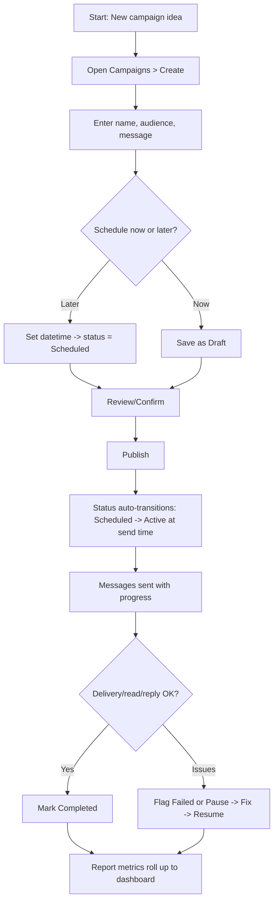
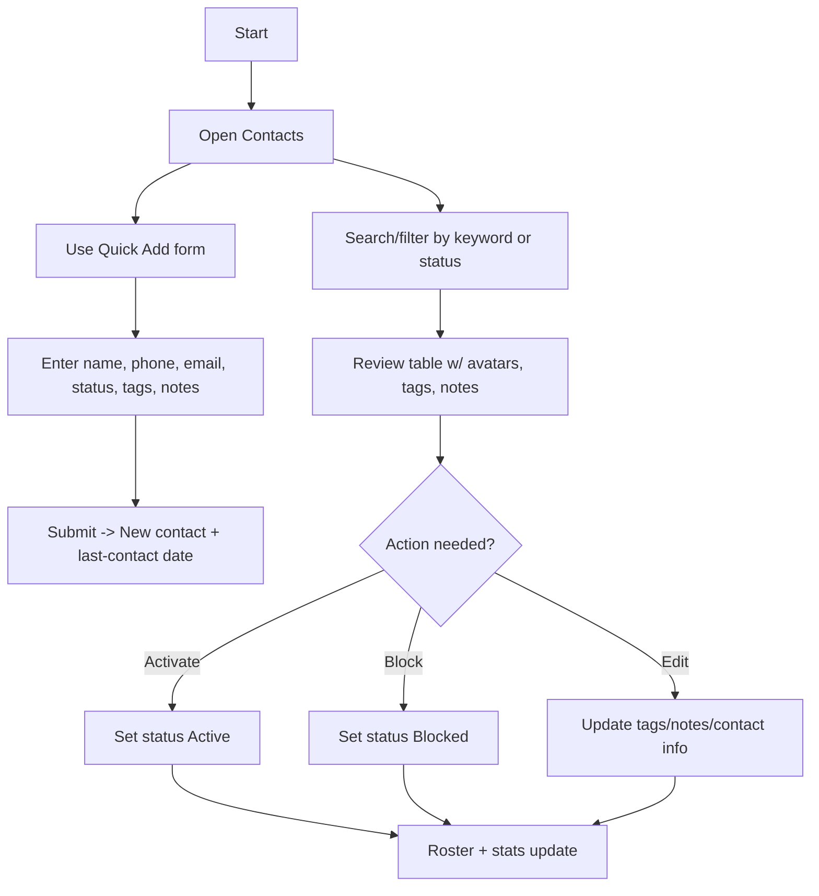
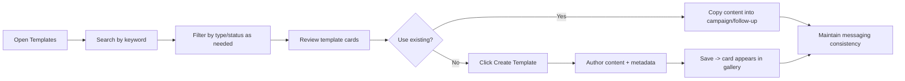
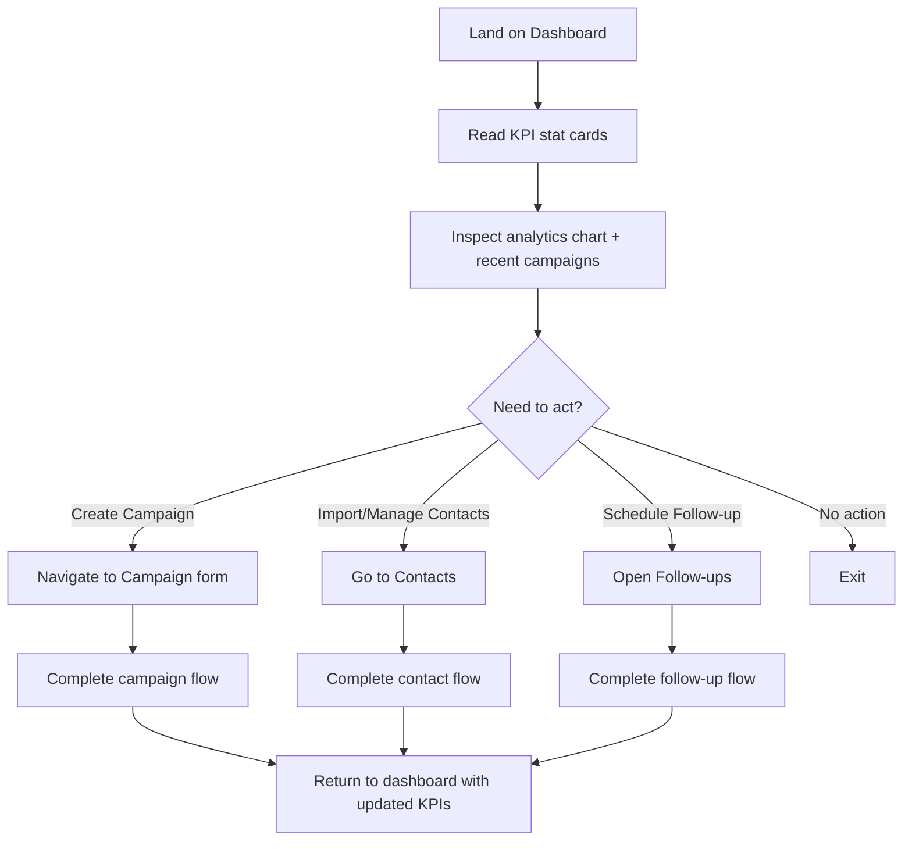

# Product Requirements Summary

This document captures the current end-to-end experience implemented in the messaging hub application so it can serve as a basis for a fuller PRD.

## Core Platform
- **Authentication entry**: Login page exists as a routed entry point alongside the primary application shell.
- **Dashboard shell**: Every page sits inside a common dashboard layout with persistent sidebar navigation (Dashboard, Templates, Contacts, Campaigns, Follow-ups, Inbox, Billing, Settings) and a collapsible state to support compact browsing.

## Dashboard
- **KPI snapshots**: Metrics for messages sent, total contacts, active campaigns, and delivery rate appear in stat cards on page load.
- **Activity overviews**: Analytics chart, recent campaigns list, and quick actions modules surface top-level performance and shortcuts.

## Campaigns
- **Dataset**: Campaign objects track name, audience, status (draft, scheduled, active, paused, completed, failed), send metrics (sent, delivered, read, replied), progress, schedule, and message copy.
- **Creation flow**: Form captures campaign name, audience, optional scheduled datetime, and message body; saving inserts a new campaign and infers initial status (scheduled if datetime provided, otherwise draft).
- **Filtering and search**: Keyword search plus status filter (all, draft, scheduled, active, paused, completed, failed) narrow the table of campaigns.
- **Monitoring**: Stat cards aggregate total sent, delivered, and replies across all campaigns.
- **Per-campaign controls**: Cards display audience, schedule, metrics, progress visualization, and quick actions to advance progress, mark completed, pause, or flag failed; completed sends also normalize delivery/read/reply counts for reporting.
- **Context chips**: Delivery plan, message preview, and state badges communicate schedule readiness, content presence, and status highlights.

## Contacts
- **Dataset**: Contacts track name, phone, email, status (active, inactive, blocked), tags, notes, and last contact date.
- **Quick add**: Intake form captures name, phone, email, status, tags (comma-delimited), and freeform notes; submission adds to the roster with today’s contact date.
- **Roster management**: Paginated table lists contacts with avatars, status badges, tags, notes, last-contact metadata, and action buttons to activate or block entries.
- **Search & filters**: Free-text search across name/phone/email and status filter (all, active, inactive, blocked); export/import buttons are present for future CSV workflows.
- **Status insights**: Stat cards summarize total, active, and blocked contacts for instant health readouts.

## Follow-ups
- **Dataset**: Follow-up tasks tie a contact to a campaign with notes, due datetime, status (scheduled, done, overdue), and priority (low, medium, high).
- **Creation flow**: Form selects campaign and contact, sets due datetime and priority, and captures notes to create a scheduled task.
- **Filtering**: Status filter (all, scheduled, overdue, done) scopes the queue table.
- **Queue management**: Tabular view shows campaign, contact, when to follow up, priority badges, notes, status chips, and actions to mark done, mark overdue, or reopen.
- **Operational telemetry**: Stat cards count scheduled, completed, and overdue tasks.

## Templates
- **Library view**: Grid of template cards with type (text/image/video), status (approved, pending, rejected, draft), category, language, and last-modified date.
- **Search and creation CTA**: Search input and “Create Template” button sit above the gallery for discovery and authoring entry.

## Inbox, Billing, Settings
- **Route placeholders**: Navigation and routing include Inbox, Billing, and Settings pages, establishing placeholders for messaging threads, subscription management, and workspace configuration.

## Navigation & Layout
- **Sidebar**: Collapsible sidebar with active-state highlighting, tooltip-friendly icons, and user block with logout affordance.
- **Theming and system providers**: Global theme provider, tooltip/toast providers, and React Query client wrap the application for consistent UX and data fetching.

## Assumptions & Next Steps
- Data shown is in-memory sample data; persistence, backend APIs, authentication, and role-based access controls remain to be specified.
- Error handling, loading states, responsive behaviors, and accessibility criteria should be elaborated during PRD finalization.

## User Stories
- **Marketing manager**: As a marketing manager, I need to build, schedule, and monitor multichannel campaigns so that I can coordinate sends around product launches without engineering support.
- **Lifecycle marketer**: As a lifecycle marketer, I want to experiment with message templates, save drafts, and reuse approved variants so that I can quickly personalize outreach to different audiences.
- **Sales rep/SDR**: As a sales rep, I need to add new leads, tag them, and log notes so that I always know the latest context when following up with customers.
- **Customer success**: As a success manager, I want a queue of scheduled follow-ups tied to accounts and campaigns so that no renewal or at-risk customer is missed.
- **Operations lead**: As an ops lead, I need visibility into delivery/reply metrics and overdue follow-ups so that I can intervene when campaigns underperform.
- **Billing admin**: As a billing admin, I want to review subscription settings and plan usage so that I can manage costs and avoid overages.

## Use Cases (Interactive Flows)
End-to-end flows are expressed as Mermaid diagrams so reviewers can step through each stage visually or embed them into documentation/whiteboards. Each flow covers the complete lifecycle from inputs to outcomes and includes failure/rollback paths where relevant.

- **Create and launch a campaign**



- **Monitor campaign performance**

```mermaid
flowchart LR
    A[Open Campaigns] --> B[Apply search/status filters]
    B --> C[Inspect stat cards (sent/delivered/replies)]
    C --> D[Open campaign card/table row]
    D --> E{Need intervention?}
    E -->|No| F[Keep running]
    E -->|Pause| G[Pause send]
    E -->|Resume| H[Resume send]
    E -->|Mark Done| I[Set Completed]
    E -->|Mark Failed| J[Stop send & flag incident]
    F --> K[Progress + metrics update continuously]
    G --> K
    H --> K
    I --> K
    J --> K
    K --> L[Dashboards and reports refresh]
```

- **Manage contacts**



- **Schedule and execute follow-ups**

```mermaid
flowchart TD
    A[Start] --> B[Open Follow-ups]
    B --> C[Create Follow-up]
    C --> D[Select campaign]
    D --> E[Select contact]
    E --> F[Set due date/time + priority]
    F --> G[Add notes]
    G --> H[Save -> task status = Scheduled]
    H --> I[Queue table lists task]
    I --> J{Due date reached or manual update}
    J -->|Complete| K[Mark Done]
    J -->|Missed| L[Mark Overdue]
    J -->|Reopen| M[Set back to Scheduled]
    K --> N[Stat cards update (completed)]
    L --> O[Stat cards update (overdue)]
    M --> P[Rescheduled task stays visible]
```

- **Template reuse and creation**



- **Dashboard awareness and quick actions**


